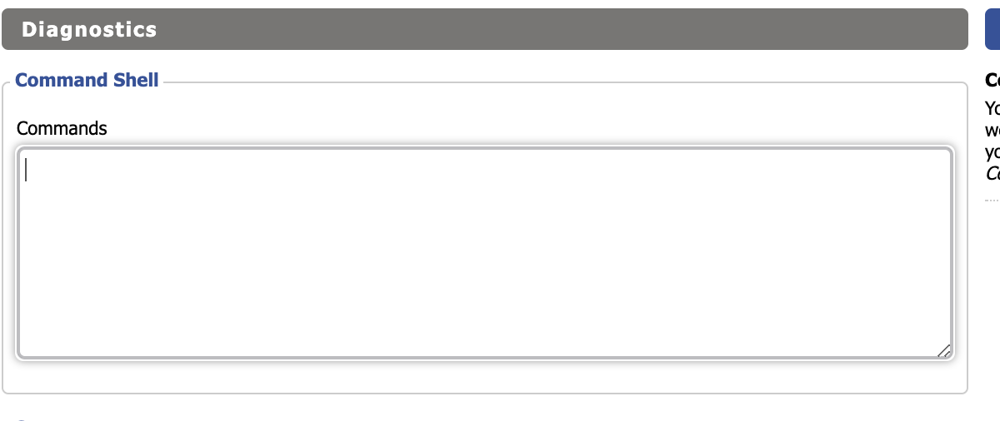
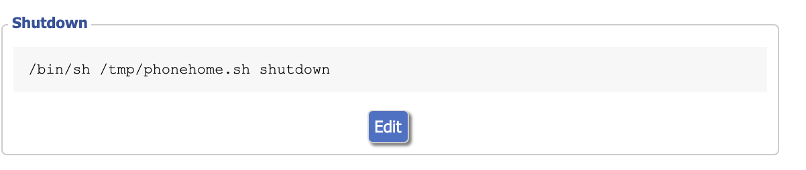
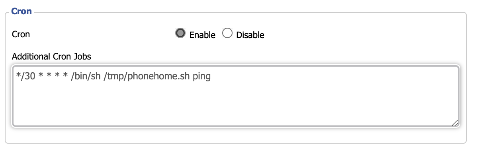

## DD-WRT Phone Home
---

A simple little bash / shell script that you can install on your [dd-wrt](https://dd-wrt.com/) router to make it phone home.

This is usefull if you have a whole bunch of remote [dd-wrt](https://dd-wrt.com/) routers and want a way to tell if one of the routers is offline or needs to be looked at in person.

## Installation
---
 1. Go to your dd-wrt router admin page.
 2. Click on ***Administration*** then ***Command*** tab.
 3. Paste in [script.sh](https://github.com/Llntrvr/dd-wrt-phonehome/blob/main/script.sh) into the ***Commands*** input box.
 
 5. Click on the ***Save Startup*** button.
 6. Paste in ```/bin/sh /tmp/phonehome.sh shutdown``` into the ***Commands*** input box.
 
 7. Click on the ***Save Shutdown*** button.
 8. Click on ***Administration*** then ***Management*** tab.
 9. Scroll down to the ***Cron*** area.
 10. Click on ***Enable*** cron option.
 
 12. Paste in ```*/30 * * * * /bin/sh /tmp/phonehome.sh ping``` into the ***Additional Cron Jobs*** input box.
 
 14. Click on the ***Save*** button.
 15. Click on the ***Apply Settings*** button.
 16. Click on the ***Reboot Router*** button.


 
 
